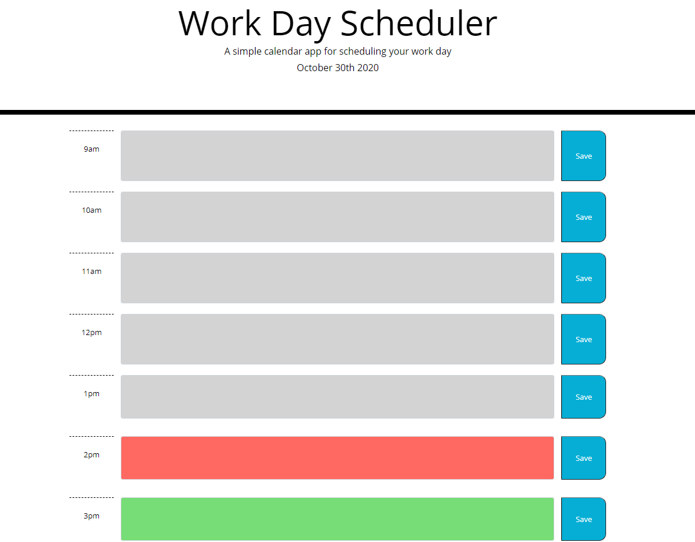

# day-planner

## Overview

This repository is a day planner used to plan events throughout a typical business day from hours 9am until 5pm. Entries will be saved when the saved button is pressed so upon return to the page your entries will still be there. Time is also indicated by color code. Grey is past, red is the current hour, and the green are future time slots. 

## Installation
* Visit https://github.com/bo-stevenson/day-planner

* Clone the repository with Git Bash(Windows) or Terminal(Mac) in directory of your choosing. 
    $ git clone git@github.com:bo-stevenson/day-planner.git 

## Usage

* Click into a text box and type an event

* Click the blue save button to save your event in local storage

* Event will be shown upon return to site.

* Today's date is shown at the top of the page.

* Current hour is displayed via color code.

## Example

Project can be viewed at https://bo-stevenson.github.io/day-planner/ 

## Credits

Bo Stevenson https://github.com/bo-stevenson 

## License 
MIT License

Copyright (c) [2020] [BoStevenson]

Permission is hereby granted, free of charge, to any person obtaining a copy
of this software and associated documentation files (the "Software"), to deal
in the Software without restriction, including without limitation the rights
to use, copy, modify, merge, publish, distribute, sublicense, and/or sell
copies of the Software, and to permit persons to whom the Software is
furnished to do so, subject to the following conditions:

The above copyright notice and this permission notice shall be included in all
copies or substantial portions of the Software.

THE SOFTWARE IS PROVIDED "AS IS", WITHOUT WARRANTY OF ANY KIND, EXPRESS OR
IMPLIED, INCLUDING BUT NOT LIMITED TO THE WARRANTIES OF MERCHANTABILITY,
FITNESS FOR A PARTICULAR PURPOSE AND NONINFRINGEMENT. IN NO EVENT SHALL THE
AUTHORS OR COPYRIGHT HOLDERS BE LIABLE FOR ANY CLAIM, DAMAGES OR OTHER
LIABILITY, WHETHER IN AN ACTION OF CONTRACT, TORT OR OTHERWISE, ARISING FROM,
OUT OF OR IN CONNECTION WITH THE SOFTWARE OR THE USE OR OTHER DEALINGS IN THE
SOFTWARE.   